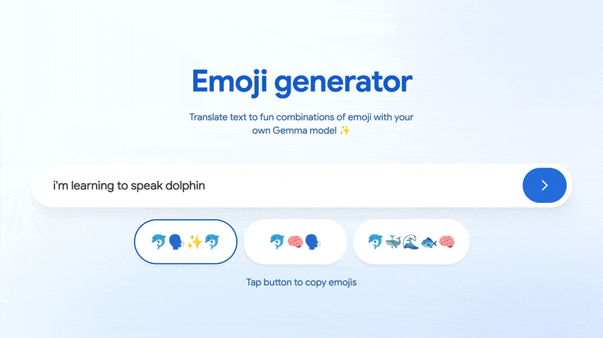

# Emoji generator web app
這個 demo 會直接在瀏覽器中執行一個針對 text-to-emoji translation 微調的 [Gemma 3 270M IT](https://huggingface.co/google/gemma-3-270m-it) 模型。Gemma 3 已獲得多種 web AI framework 支援，部署相對容易。你可以使用下列任一方式執行 app：

* **[MediaPipe LLM Inference API](./app-mediapipe)** - 需要放在 `.task` bundle 中的 LiteRT 模型
* **[Transformers.js](./app-transformersjs)** - 需要 `.onnx` 模型

如果你還沒有微調好的模型，請先參考下方資源。

可在 [Hugging Face](https://goo.gle/emoji-gemma-demo) 預覽此 app。

## 資源

你可以在 Google Colab 中使用這些 notebooks，將 Gemma 3 270M 微調並優化為適合 web 部署。若要將模型微調為 emoji translation 任務，你可以自行建立資料集，或使用我們提供的 [現成資料集](./resources/Emoji%20Translation%20Dataset%20-%20Dataset.csv)。

| Notebook  | Description |
| ------------- |-------------|
| [Fine-tune Gemma 3 270M](./resources/Fine_tune_Gemma_3_270M_for_emoji_generation.ipynb)   | 使用 Quantized Low-Rank Adaptation（QLoRA）將 Gemma 微調為 emoji translation |
| [Convert to MediaPipe](./resources/Convert_Gemma_3_270M_to_LiteRT_for_MediaPipe_LLM_Inference_API.ipynb) | 將微調後的 Gemma 3 270M 模型量化並轉換為 `.litert`，再封裝成 `.task` 檔以供 LLM Inference API 使用 |
| [Convert to ONNX](./resources/Convert_Gemma_3_270M_to_ONNX.ipynb) | 將微調後的 Gemma 3 270M 模型量化並轉換為 `.onnx`，以便搭配 ONNX Runtime 與 Transformers.js 使用 |
