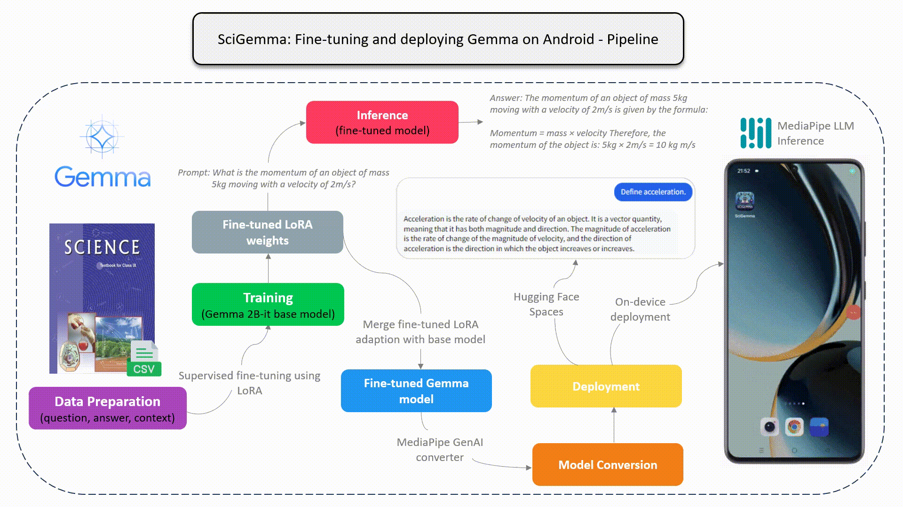

#### 由 [Aashi Dutt](https://linkedin.com/in/aashi-dutt) 和 [Nitin Tiwari](https://linkedin.com/in/tiwari-nitin) 開發。

# Android 上的Gemma
該專案是 fine-tuning Gemma 2b-it 模型在自訂 dataset 上的實現，並在 Android 上部署微調後的模型。

## 管道：




## 演示輸出：


## 執行步驟：

1. 將儲存庫克隆到本機上。
2. 開啟 Android Studio 中的項目。
3. 編輯 **第 44 行** 上的 ```InferenceModel.kt``` 文件，將 ```YOUR_MODE_NAME.bin``` 替換為模型的實際名稱。
4. 建構項目。
5. 在您的手機上安裝 Android 應用程式並享受使用 SciGemma 的樂趣。


## 資源：

1. 按照三個 blog 系列詳細解釋程式碼：
   
第 1 部分：[逐步建立 dataset - 非結構化到結構化](https://aashi-dutt3.medium.com/part-1-step-by-step-dataset-creation-unstructured-to-structured-70abdc98abf0)
第 2 部分：[微調 - Gemma 2b-it 模型](https://aashi-dutt3.medium.com/part-2-fine-tune-gemma-2b-it-model-a26246c530e7)
第 3 部分：[在 Android 上部署 SciGemma](https://tiwarinitin1999.medium.com/part-3-deploy-gemma-on-android-5bac532c54b7)
3. 🤗 上的微調模型：https://huggingface.co/NSTiwari/fine_tuned_science_gemma2b-it

4. Try our model on HFSpaces: [https://huggingface.co/spaces/Aashi/NSTiwari-fine_tuned_science_gemma2b-it?logs=container](https://huggingface.co/spaces/Aashi/NSTiwari-fine_tuned_science_gemma2b-it)

5. 在 YouTube 上查看演示影片：https://www.youtube.com/watch?v=T_HDsVHTrwg

