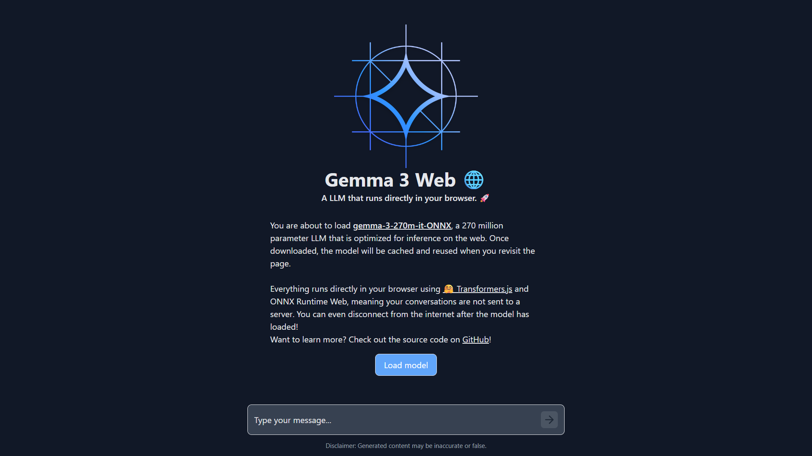

### 由 [Sitam Meur](https://linkedin.com/in/sitammeur) 開發。

# 使用 ONNX & Transformers.js 在瀏覽器上推論 Gemma 3

這是一個簡單的 Web 應用程序，示範如何使用 [Transformers.js](https://huggingface.co/docs/transformers.js) 和 ONNX Runtime Web 在瀏覽器中使用 [Gemma 3 270M](https://huggingface.co/onnx-community/gemma-3-270m-it-ONNX) 模型。該應用程式允許用戶與Gemma 3 270M 模型聊天並接收即時回應。
## 專案結構

該項目的架構如下：
- `assets/`：此目錄包含最終應用程式的螢幕截圖。

- `public/`：靜態資源，如圖像、圖示和字體。

- `src/`：應用程式的核心原始碼。

  - `components/`：應用程式可重複使用的 React 元件。

- `icons/`：應用程式的圖示組件。
- `ArrowRightIcon.jsx`：向右箭頭圖示組件。 - `BotIcon.jsx`：機器人圖示組件。 - `StopIcon.jsx`：停止圖示組件。 - `UserIcon.jsx`：使用者圖示組件。
- `Chat.jsx`：用於顯示聊天訊息的聊天元件。 - `Progress.jsx`：用於顯示進度條的進度組件。
  - `styles/`：用於設計應用程式樣式的 CSS 檔案。

- `index.css`：應用程式的全域 CSS 樣式。 - `Chat.css`：聊天介面的 CSS 樣式。
  - `worker.js`：Transformers.js用於執行Gemma 3模型的工作人員。
  - `App.jsx`：應用程式的主要 React 元件。
  - `main.jsx`：應用程式的入口點。

- `.gitignore`：指定 Git 應忽略哪些檔案和目錄。
- `README.md`：專案文件和設定說明。
- `index.html`：應用程式的主要 HTML 檔案。
- `package.json`：專案依賴與腳本設定。
- `tailwind.config.js`：Tailwind CSS 設定檔。
- `vite.config.js`：Vite 專案的設定檔。

## 使用的技術

- **HTML**：用於建立網頁的標準標記語言。
- **Tailwind CSS**：用於設計 Web 應用程式樣式的實用優先 CSS framework。
- **JavaScript**：用於建立 Web 應用程式的高階程式語言。
- **React**：JavaScript library 用於建立使用者介面。
- **Transformers.js**: JavaScript library for running Hugging Face models in the browser.

## 入門

To get started with this project, follow the steps below:

1. 克隆儲存庫：`git clone https://github.com/google-gemini/gemma-cookbook.git`
2. 更改目錄：`cd gemma-cookbook/Demos/Gemma3-on-Web`
3. 安裝所需的依賴項：`npm install`
4. 執行應用程式：`npm run dev`

開啟本機主機，在瀏覽器中查看 Web 應用程式 `http://localhost:5173/`。
> [！筆記]
> 第一次載入模型權重大約需要 10-15 分鐘。

## 結果

**注意**：若要查看結果，請參閱儲存庫中的 `assets` 資料夾。
## 資源和參考資料

1. [Google 開發者文章](https://developers.googleblog.com/en/introducing-gemma-3-270m/)
2. [Hugging Face ONNX 型號](https://huggingface.co/onnx-community/gemma-3-270m-it-ONNX)
3. [Transformers.js GitHub](https://github.com/huggingface/transformers.js)
4. [ONNX 社群](https://huggingface.co/onnx-community)
