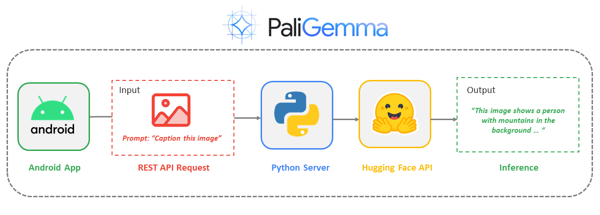
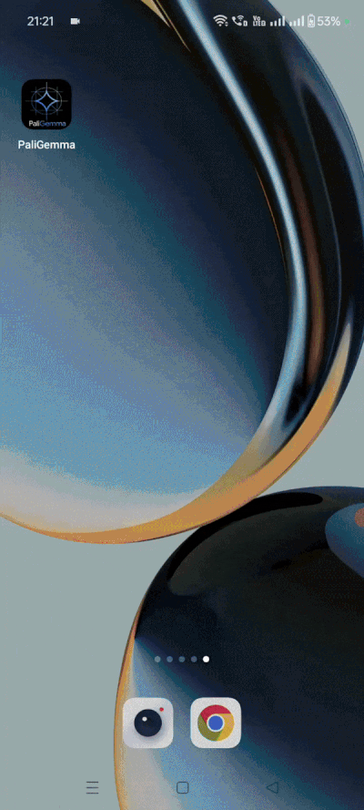
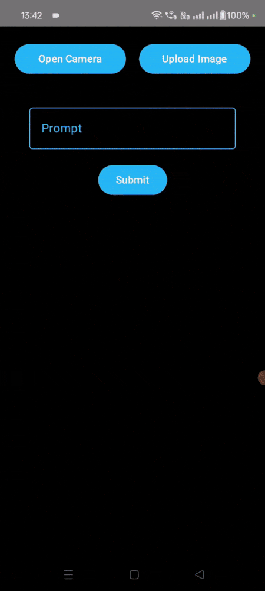

#### 由 [Nitin Tiwari](https://linkedin.com/in/tiwari-nitin)、[Sagar Malhotra](https://linkedin.com/in/sagar0-0malhotra) 和 [Savio Rodrigues](https://x.com/sloathee) 開發。

# PaliGemma 安卓高頻
該儲存庫是在 Android 上使用 Hugging Face-Gradio 用戶端 API 推斷 PaliGemma 視覺語言模型的實現，用於零樣本目標檢測、圖像字幕和視覺問答等任務。

## 管道：

## 演示輸出：

**視覺問答、零樣本目標偵測、影像字幕**

**參考表達分割**

