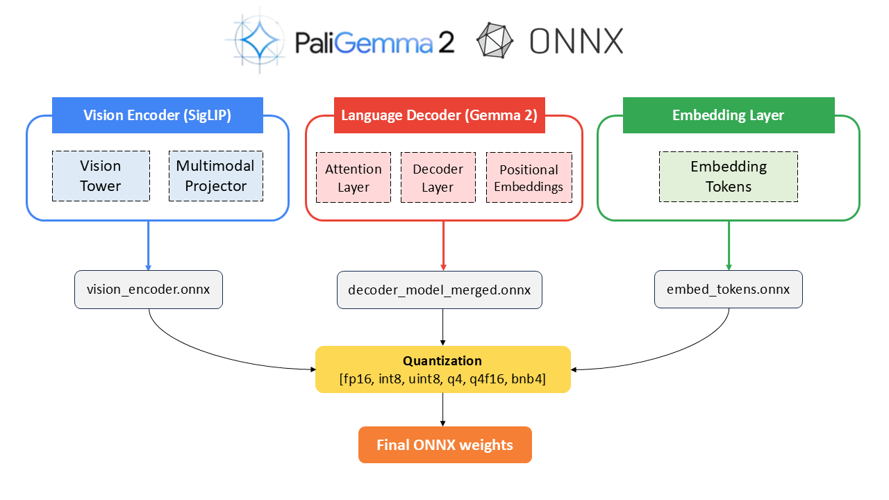
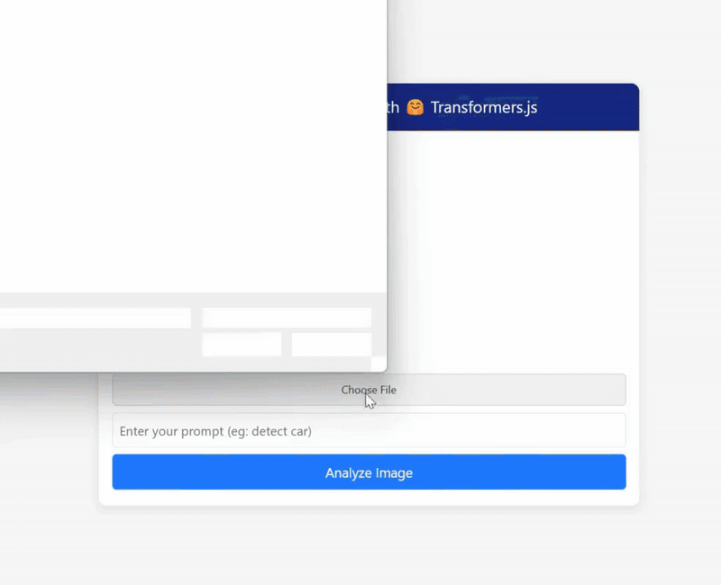

### 由 [Nitin Tiwari](https://linkedin.com/in/tiwari-nitin) 開發。

# 使用 ONNX 與 Transformers.js 在瀏覽器中對 PaliGemma 2 執行推論
這個專案示範如何使用轉換後的 ONNX weights 與 Hugging Face Transformers.js，在瀏覽器中對 paligemma2-3b-mix-224 模型進行推論。

## PaliGemma 2 轉 ONNX 流程：

## 執行步驟：

1. 在本機複製這個 repository。
2. 切換到 `gemma-cookbook/Demos/PaliGemma2-on-Web` 目錄。
3. 執行 `npm install` 安裝 Node.js packages。
4. 執行 `node server.js` 啟動 server。
5. 在瀏覽器開啟 `localhost:3000`，開始使用 PaliGemma 2 進行推論。

> [!NOTE]  
> 第一次執行時，模型 weights 載入大約需要 10 到 15 分鐘。

## 結果：

## 資源與參考資料

1. [Google DeepMind PaliGemma 2](https://developers.googleblog.com/en/introducing-paligemma-2-mix/)
2. Colab Notebooks: 
<table>
  <tr>
    <td><b>Convert and quantize PaliGemma 2 to ONNX</b></td>
    <td></td>
  </tr>
  <tr>
    <td><b>Inference PaliGemma 2 with Transformers.js</b></td>
    <td></td>
  </tr>
</table>

3. [**Medium Blog**](https://medium.com/@tiwarinitin1999/inference-paligemma-2-with-transformers-js-5545986ac14a) 提供逐步實作說明。
4. [ONNX Community](https://huggingface.co/onnx-community)
